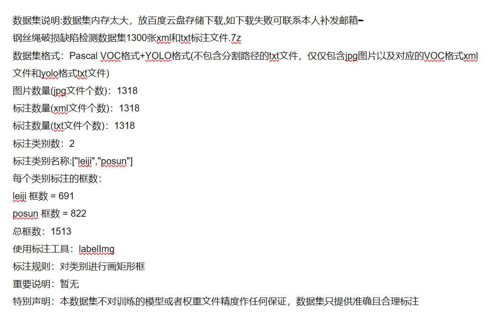
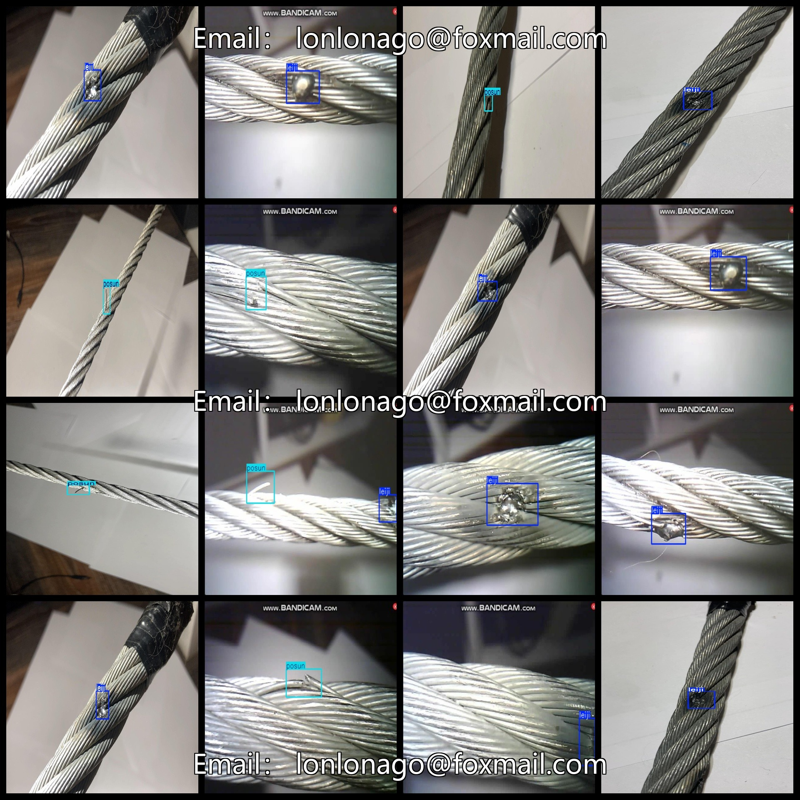

# [Object Detection Dataset] Wire Rope Damage Burns Defect Detection Dataset VOC+YOLO format1318 images2-class

Dataset Description: ~

Wire Rope Damage Defect Detection Dataset 1300stretchxmland txtannotation File.7z

Dataset format: Pascal VOC format + YOLO format (the txt file does not contain the split path, it only contains jpg images and corresponding VOC format xml files and yolo format txt files)

Number of images (number of jpg files): 1318

Number of annotations (number of xml files): 1318

Number of annotations (number of txt files): 1318

Label count: 2

Annotation class names: ["leiji","posun"]

Number of boxes labeled in each category:

leiji frame count = 691

posun frame count = 822

Total boxes: 1513

Use the labeling tool: labelImg

Rules for annotation: Draw a rectangle around the category.

Important Note: None

Special Notice: This dataset does not guarantee the accuracy or precision of the trained models or weight files. The dataset only provides accurate and reasonable annotations.

## Images

---

Here is a pay link on Stripe (https://buy.stripe.com/3cs8yP7sY87d0vu9AB). Please contact me lonlonago@foxmail.com after funding $89, and I will send you a complete data files, thank you!

